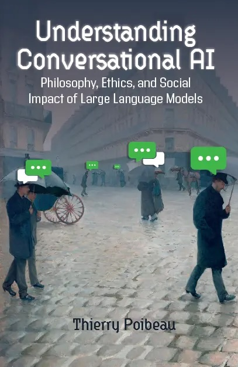

This page is a companion site for the book [Understanding Conversational AI: Philosophy, Ethics, and the Social Impact of Large Language Models](), published by Ubiquity Press in December 2025.  

The book is fully open access and examines large language models from philosophical, ethical, and societal perspectives.  

This page provides additional materials, updates, and resources related to the book.

**Reference: **
Understanding Conversational AI: Philosophy, Ethics, and Social Impact of Large Language Models  
Thierry Poibeau  
Ubiquity Press (open access)  
Lien : [https://ubiquitypress.com/books/m/10.5334/bde](https://ubiquitypress.com/books/m/10.5334/bde)  

   

**Table of content**  

**INTRODUCTION.** Speaking machines, thinking humans  

**PART I: SENSE WITHOUT REFERENCE** (large language models and language)  
*Chapter 1.* Latent linguistics: the conception of language in large language models  
*Chapter 2.* From the design of large language models to a reassessment of linguistic theory  
*Chapter 3.* Large language models and the future of writing  

**PART II: THE RISKS OF ANTHROPOMORPHISM** (large language models and the mind)  
*Chapter 4.* Large language models and reasoning, the boundaries of mind and consciousness  
*Chapter 5.* Large language models and creativity  
*Chapter 6.* Moral reasoning and synthetic judgment in large language models  

**PART III: THE SOCIAL LIFE OF LARGE LANGUAGE MODELS** (their reach, roles, and consequences)  
*Chapter 7.* Large language models and critical thinking: bias, social impact, and political implications  
*Chapter 8.* Disinformation, misinformation, and the crisis of trust in AI-generated content  
*Chapter 9.* Ethics at scale  

**CONCLUSION.** Thinking with machines  

*Annex.* The architecture and training of large language models

